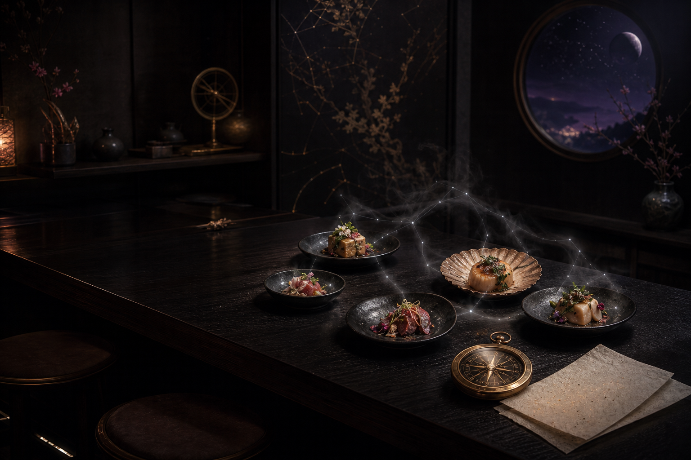

# Omakase

> お任せ means "I'll leave it to the chef."

Omakase is an anime sommelier. It pairs your scored watch history with a short description of your taste, then asks a model you choose to prepare a small recommendation menu with a reason for every pick.

[Try the public counter](https://omakase.jhinx.dev) · [Read the case study](https://jhinx.dev/projects/omakase) · [Visit jhinx.dev](https://jhinx.dev)

[](https://github.com/HeyiTzSenpai/omakase/actions/workflows/ci.yml)
[](https://www.python.org/downloads/)
[](LICENSE)



## What makes it different

Most recommendation systems know what is popular. Omakase tries to understand why a story worked for you.

It combines:

- your AniList history or MyAnimeList export;
- the scores and statuses already in that history;
- optional notes about themes, moods, characters, and patterns you value;
- an unwatched candidate pool;
- a model selected and paid for by you.

The result is a short tasting menu instead of an endless popularity feed. Each recommendation includes a predicted fit, an explanation, and a title from your history that helped shape the match.

## Public counter

The hosted site supports request-local keys for OpenAI, Anthropic, Gemini, DeepSeek, OpenRouter, and owner-approved OpenWebUI instances. Both Quick and Deep model presets run as background jobs, so a slower reasoning model can finish without holding one proxy request open. OpenWebUI asks for the instance URL and the exact model ID shown there. Choose the provider explicitly: several provider keys can share the same shape, so key text alone is not a safe provider signal.

Guest menus remain request-local. The provider key, history, and taste notes are not written to disk, logs, cookies, or a database. Your history and notes are sent to the provider you select so it can generate the menu. That provider's own data policy still applies.

The hosted counter accepts a public AniList username or a MyAnimeList XML export. Local model addresses are intentionally unavailable there because a public server cannot safely or honestly connect to a model running on your computer. A hosted OpenWebUI URL must use HTTPS and match an origin the Omakase owner explicitly allowlisted.

### Omakase Lite accounts

Lite accounts are invitation-only. The owner creates a one-time, seven-day link from the private Invitations page and shares it directly with a friend; the recipient supplies their own name, email, and password while claiming it. There is no public access-request form or queue. Every successful claim appears in the owner-only invitation ledger with the member's name, email, acceptance time, and a stable public number that is separate from internal database IDs. A Lite account adds:

- saved recommendation history and a local My List;
- encrypted, reusable provider keys that are never shown back to the browser;
- Not Interested, Add to My List, and scored Already Watched feedback, with
  optional verified write-through to the member's own connected AniList account;
- a saved taste note, remembered setup, and feedback-aware menus that avoid repeats;
- one-click regeneration from the current result page;
- no Plex, download, acquisition, or private Plus access.

Lite saves completed recommendations, the account profile, setup choices, and feedback in its own SQLite database. Provider keys are encrypted at rest with a protected server-side Fernet keyring, decrypted only for the selected provider request, and cleared from job memory when the request finishes. Uploaded MAL files remain request-local. Passwords use Argon2id, sessions and invitations are stored only as hashes, mutating account requests require authentication, owner authorization where applicable, same-origin and CSRF validation, and account/API responses are not browser-cached.

AniList synchronization is opt-in per Lite member. Register the exact
`https://your-host/account/integrations/anilist/callback` URL with AniList, set
`OMAKASE_ANILIST_CLIENT_ID`, and mount the client secret at the
`OMAKASE_ANILIST_CLIENT_SECRET_FILE` path. Access tokens are bound to the AniList
identity the member approved and encrypted with the Lite keyring. Omakase writes
only when the connected username matches the username used to build that menu,
then stores AniList's returned list-entry receipt.

For Docker Compose, include `compose.anilist.yaml` alongside `compose.yaml` and
`compose.production.yaml` after creating `secrets/anilist-client-secret`. The
separate overlay keeps deployments that do not use AniList synchronization from
requiring an empty secret file. On a root-managed Linux host, give that secret
the same owner, group, and non-world-readable mode as the existing Lite keyring
so the unprivileged container process can read it.

## Run it yourself

Self-hosting unlocks local Ollama, LM Studio, and OpenWebUI instances as well as the supported cloud providers.

```bash
pip install omakase

# Create a starter taste profile
omakase init

# Use local Ollama with your AniList history
omakase recommend -u your-anilist-handle

# Or open the browser interface
omakase web
```

Install from source when developing:

```bash
git clone https://github.com/HeyiTzSenpai/omakase
cd omakase
pip install -e .
```

## Choose a model

The command line supports local and cloud backends. Cloud credentials can use `OMAKASE_API_KEY` or the provider-specific environment variable.

```bash
# OpenAI
export OMAKASE_API_KEY=your-key
omakase recommend -u your-handle --llm-type openai --mode pro

# Anthropic
export OMAKASE_API_KEY=your-key
omakase recommend -u your-handle --llm-type anthropic --mode pro

# Gemini
export OMAKASE_API_KEY=your-key
omakase recommend -u your-handle --llm-type gemini

# DeepSeek
export OMAKASE_API_KEY=your-key
omakase recommend -u your-handle --llm-type deepseek --mode pro

# OpenWebUI
export OMAKASE_API_KEY=your-openwebui-key
omakase recommend -u your-handle --llm-type openwebui \
  --llm-url https://models.example.com --model llama3.1:8b
```

Supported backends include Ollama, LM Studio, OpenWebUI, OpenAI, Anthropic, Gemini, DeepSeek, OpenRouter, Groq, and Together. Use `--model` to override a preset.

## The pipeline

```text
taste notes + scored history + unwatched candidates
                         |
                         v
                  selected model
                         |
                         v
       ranked picks + reasoning + history pairing
```

Omakase keeps its extension points small. Source adapters normalize watch history and candidates. Model adapters handle provider protocols. The recommendation engine builds one prompt and returns the same structured result to the terminal, JSON output, or browser interface.

## Commands

| Command | Purpose |
|---|---|
| `omakase recommend -u <user>` | Prepare a recommendation menu |
| `omakase web` | Start the browser interface |
| `omakase init` | Create a starter taste profile |
| `omakase sources` | List available history sources |
| `omakase backends` | List available model backends |
| `omakase account-bootstrap` | Import an Argon2id hash for the Lite owner |

Run `omakase recommend --help` for all options. See [CONTRIBUTING.md](CONTRIBUTING.md) for development and extension guidance.

## Hosted deployment

The base Compose stack persists Lite state in the `omakase_lite_data` volume. Production uses a protected Fernet keyring to encrypt member-saved provider keys. To enable one or more OpenWebUI instances on the hosted counter, set `OMAKASE_OPENWEBUI_ALLOWED_ORIGINS` to a comma-separated list of exact HTTPS origins (for example, `https://models.example.com`); paths are entered by the visitor and redirects are not followed.

```bash
mkdir -p secrets
python -c "from cryptography.fernet import Fernet; print(Fernet.generate_key().decode())" \
  > secrets/lite-keyring
chmod 700 secrets
chgrp 1000 secrets/lite-keyring
chmod 640 secrets/lite-keyring
docker compose -f compose.yaml -f compose.production.yaml up -d --build
```

The container runs as UID/GID 1000, so the keyring must be group-readable by GID 1000 on the host. Keep the Lite keyring stable: replacing it makes existing saved provider keys unreadable. Only an authenticated owner with valid same-origin and CSRF checks can create an invitation. One-time invitation secrets travel in the URL fragment, which browsers do not send in HTTP requests, then move into the claim form body. Bootstrap the owner by piping an existing Argon2id hash over standard input; the command never prints the hash:

```bash
docker compose exec -T omakase \
  omakase account-bootstrap --email owner@example.com --password-hash-stdin \
  < /secure/path/owner.argon2
```

## Scope

This public repository is the bring-your-own-key recommendation tool plus its recommendation-only Lite accounts. Omakase Plus is a separate private system and is not connected to the hosted demo.

## License

MIT. See [LICENSE](LICENSE).
